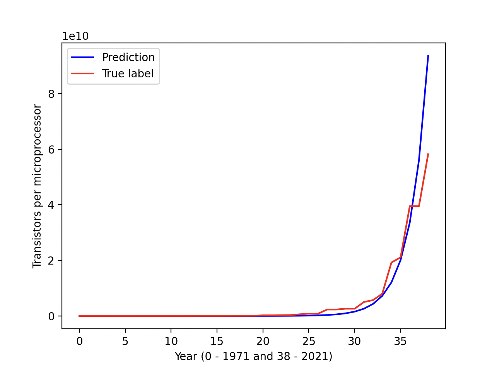

# Predicting an equation to depict Moore's Law using Machine Learning.

Moore's Law is described by the famous quote by Gordon Moore, co-founder of Fairchild Semiconductor and Intel, in 1965, saying that every 18 months to two years, it would be possible to get as many transistors which you can have for the same amount of money. Of course, there is not a formal prove of this statement, being a big polemic in Computer Science. 

This repository aims to extract a mathematical relationship to depict the Moore's Law from the following [data set](https://ourworldindata.org/grapher/transistors-per-microprocessor). As this data set only has 38 points, it was a difficult task to produce an acceptable formula. However, with the code at this repo, it was possible to get the following approximation: 


<div align="center">
  
</div>


The final equation obtained was: 

```
f(x) = exp^(0.5121*x + 5.8)
```

As f being the number of transistors per microprocessors in the year x (counting from 1971, e.g 1971 - 0, 1972 - 1, etc.)
